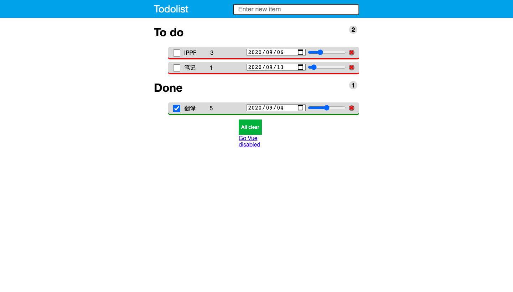

# Tutorial to TODO list

For your convenience, (and because we know you will do it anyways,) we have looked up online and found a todo list project on [a CSDN page](https://blog.csdn.net/z_cas/article/details/78714289). Well, although you don't need to re-invent the wheel, there are several things you need to do:

- Read through ***every*** line of the code, and understand as detailedly as you can what each line does. Write detailed documentation for each function, including the following information:
  - When will this function be called (e.g. when `btnA` is pressed; called by `funcA`);
  - What the function implements and how it's implemented.
  - What each variable does (this won't be required in the actual documentation, but we ask you to do it so that you understand everything.)
- There's a very nasty bug in the JavaScript code that prevents any of the components (tickbox for moving items between the **TODO** section and the **DONE** section, remove button to remove the item from the list, input box for renaming) from working. Locate the bug and fix it. (If you spent ten days before you finally found the bug, or you never did at all, try re-typing everything)
- The page looks like it's from the 2000s. Try making it prettier by modifying the CSS file. You may use this as a reference:

Of course you will rely on external stylesheets (e.g. Bootstrap) most of the time in the future, but we still would like you to dive into the amazing world of CSS and understand everything from the basic level.
- Add more functionalities, e.g. setting deadlines and priorities, making items always sorted by priority, etc.