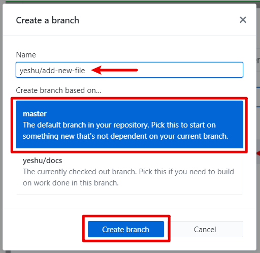
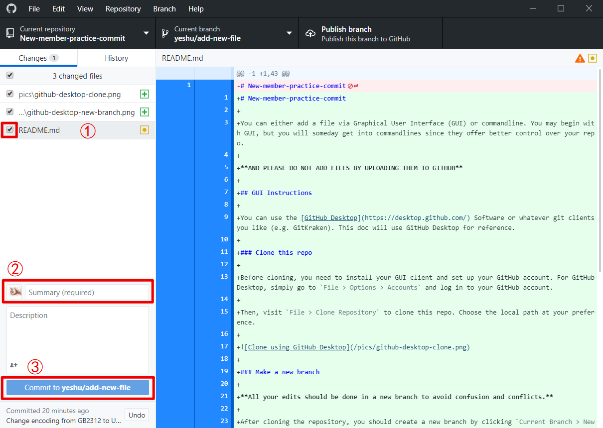

# New-member-practice-commit

You can either add a file via Graphical-User-Interface(GUI)-powered GitHub Desktop or command line. You may begin with GUI, but you will someday get into command lines since they offer better control over your repo. Furthermore, Visual Studio Code users can try out the built-in source control.

**AND PLEASE DO NOT ADD FILES BY UPLOADING THEM TO GITHUB**

## Table of Contents

- [New-member-practice-commit](#new-member-practice-commit)
  - [Table of Contents](#table-of-contents)
  - [Understanding git workflow](#understanding-git-workflow)
  - [GUI Instructions](#gui-instructions)
    - [Clone this repo](#clone-this-repo)
    - [Create a new branch](#create-a-new-branch)
    - [Add file and commit](#add-file-and-commit)
    - [Push branch](#push-branch)
    - [Create pull request](#create-pull-request)
  - [Command Line Instructions](#command-line-instructions)
    - [Clone this repo (CLI)](#clone-this-repo-cli)
    - [Create a new branch (CLI)](#create-a-new-branch-cli)
    - [Add file (CLI)](#add-file-cli)
    - [Commit (CLI)](#commit-cli)
    - [Push branch (CLI)](#push-branch-cli)
    - [Create pull request (CLI)](#create-pull-request-cli)
  - [VS Code Instructions](#vs-code-instructions)
    - [Clone this repo (VS Code)](#clone-this-repo-vs-code)
    - [Create a new branch (VS Code)](#create-a-new-branch-vs-code)
    - [Add file and commit(VS Code)](#add-file-and-commit-vs-code)
    - [Commit (VS Code)](#commit-vs-code)
    - [Push branch (VS Code)](#push-branch-vs-code)
    - [Create Pull Request (VS Code)](#create-pull-request-vs-code)
    - [Invoking terminal](#invoking-terminal)
  - [Further Reading](#further-reading)

## Understanding git workflow

We find it necessary to tell you what you are actually doing each step instead of having you follow the written instructions mechanically. This especially helps since things hardly go as beautifully as the tutorial expects. This section assumes no prior knowledge of any git operations.

You can understand git as a version control system. It keeps track of how each file has been created, modified, and deleted, and the repository owner can switch to any saved version (commit), just like the save files in a game.

Suppose there's a repository out on GitHub named `Hello`, created by Alice to host perhaps *the* most famous piece of code in history. Its directory looks like this:

```bash
.
├── Hello.cpp
│
├── Contributors.txt
│
└── README.md
```

```C++
// Hello.cpp
#include <iostream>
using namespace std;
int main() {
  cout << "Hello world!" << endl;
}
```

```bash
// Contributors.txt
Alice
```

```Markdown
// README.md
# Hello world
A piece of C++ code that prints `Hello world!`
```

View each commmit as a snapshot of the entire repo. In fact it's much more lightweight than a complete copy, but in essence it contains all the information at that moment. And this version can be viewed as commit `C0`. (Every commit has a unique hash that's too long to be human-readable, so `C0` will suffice.) We also call it the `master` branch. *A branch is a series of commits that form a linear relationship of succession, with the `master` branch being the "main" branch. In essence, it's a pointer to a commit.* 

Bob the linguist finds this repo. He finds great interest in it, but his strong objection to the clichéd `Hello world!` motivates him to make a contribution. To do this, he needs to download this folder (or repository, as people call it) first. This is basically what [cloning](#clone-this-repo) does.

After he has a complete copy of the code on his own machine, Bob sets out to make edits. He updates all three files:
```C++
// Hello.cpp
#include <iostream>
using namespace std;
int main() {
  cout << "Bonjour le monde!" << endl;
}
```

```bash
// Contributors.txt
Alice
Bob
```

```Markdown
// README.md
# Hello world
A piece of C++ code that prints `Bonjour le monde!`
```

And now he needs to send it back to GitHub, as his instinct tells him. This is done by directly making a commit. However there's a critical problem here: *Alice has zero control over Bob's action*. In fact, most public repos (including Computerization's) restrict people from commiting directly to `master`, because there's no point of authentication. Once the commit is made, Alice would be back and surprisedly find her code becoming French. And it's bad practice anyways: **In any collaborative repository, never commit directly to master.** ~~(Unless you are resigning in a week)~~ There's another problem with commiting to `master`, which we will shortly see.

So to fix this problem, Bob [creates a new branch](#create-a-new-branch), and names it `Bob/change-output-language`. We may see this as Bob working on a separate but identical folder, and anything he does will not affect `master`. This not only clarifies his purpose, identifies his position as an author, but also prevents conflict and/or confusion.

He made the said changes. But then he remembered another code of honor:
**one commit should only serve one purpose**. Looking back at his changes, he believes that changing the language and adding his name in the `Contributors.txt` should be separate things (the difference is minute here, but in real projects it gets obvious). Therefore he [makes two commits](#add-file-and-commit) called `Change output to French` and `Add Bob's name to Contributors.txt`, which will be neatly given hashes `C1` and `C2`. Note he did not necessarily work on them sequentially, but git treats `C2` as a successor of `C1` since it's a more recent commit. Now the branch `Bob/change-output-language` refers to the commit `C2`.

At this point his changes have remained local -- no one can see it on the GitHub page. So then he [publishes the branch and pushes it to the origin](#push-branch). This uploads this branch, `Bob/change-output-language`, with all the commits it contains, to the GitHub remote.

After he has published the branch, any further commits he makes on this branch will be automatically synchronized with GitHub as well.

Directly after, he [makes a pull request](#create-pull-request) to ask the code owner (a.k.a. Alice) to merge this branch. *When a branch is merged, all the changes will now be reflected in `master`.* 

This sounds really simple when there's only one branch, because git simply adds everything to `master` when all commits are successors of `master`, which is now `C0`. And in fact, above is all for new git users to understand. But as future GitHub admins, you deserve to think a little deeper.

So to make thing more fun, Cindy the orthodox comes simultaneously with Bob. Outraged by Alice dropping the `return 0` in the cpp file, she decides to fix it. Similarly, she creates a new branch `Cindy/improve-code-style` from `master`, which at this point is still `C0`. The files are changed as:
```C++
// Hello.cpp
#include <iostream>
using namespace std;
int main() {
  cout << "Hello world!" << endl;
  return 0;
}
```

```bash
// Contributors.txt
Alice
Cindy
```

```Markdown
// README.md
# Hello world
A piece of C++ code that prints `Hello world!`
```

She publishes the branch and opens a pull request.

Alice, after her tea break, comes back to find the two pull requests. She happily merges Bob's one; but then Cindy's one she can not merge on click of a button. GitHub throws a warning, telling her there's a conflict with `master`. She has to resolve the conflict manually, because git didn't know which version to keep when they are made parallelly. The resolving page shows something like:
```C++
// Hello.cpp
 #include <iostream>
 using namespace std;
 int main() {
 <<<<<<< master
   cout << "Bonjour le monde!" << endl;
 =======
   cout << "Hello world!" << endl;
   return 0;
 >>>>>>> Cindy/improve-code-style
 }
```
```bash
// Contributors.txt
 Alice
 <<<<<<< master
 Bob
 =======
 Cindy
 >>>>>>> Cindy/improve-code-style
```

Note that the README.md file needs no resolution because only Bob had made a change; git is smart enough to realize that. But the above issues are pressing. How to resolve them are pretty apparent to humans like Alice, though, so she quickly fixed these, and merged Cindy's branch with no conflict. The files are now:

```C++
// Hello.cpp
#include <iostream>
using namespace std;
int main() {
  cout << "Bonjour le monde!" << endl;
  return 0;
}
```

```bash
// Contributors.txt
Alice
Bob
Cindy
```

```Markdown
// README.md
# Hello world
A piece of C++ code that prints `Bonjour le monde!`
```

And Alice, Bob, and Cindy are happy about their successful collaboration over GitHub on an open-source project. 

To understand more about git and its tree structure (as already implied above), check this out: [Learn Git Branching](https://learngitbranching.js.org)

## GUI Instructions

You can use the [GitHub Desktop](https://desktop.github.com/) Software or whatever git clients you like (e.g. GitKraken). This doc will use GitHub Desktop for reference.

### Clone this repo

First thing you need to do is click the "fork" button at the top-right corner of the screen. This creates your own copy of the repo. Now you need to download (or clone) this repo to your own machine. If you don't do this at this point, it's also fine—you probably don't (not yet, at least) have write access to the repo, so when you push, you will be asked to create a fork.

Before cloning, you need to install your GUI client and set up your GitHub account. For GitHub Desktop, simply go to `File > Options > Accounts` and log in to your GitHub account.

Then, visit `File > Clone Repository` to clone this repo. Choose the local path at your preference.


### Create a new branch

Because we have the **never work on the master branch** policy, the first thing one wants to do (and should never forget to) is to create a new branch to host all the commits. **All your edits should be done in a new branch to avoid confusion and conflicts.**

After cloning the repository, you should create a new branch by clicking `Current Branch > New Branch`.

Then, briefly name this new branch as `[your id]/[what you will do]`. in this case, it is `yeshu/add-new-file`.

Do make sure the new branch is based on master branch.



### Add file and commit

In GitHub Desktop, adding and commiting a file is pretty simple:

1. Tick the boxes before the files you'd like to add
2. Write a brief summary (<50 words) for what you've done. You are also recommended to write a longer description for that in the space below.
3. Click commit button



### Push branch

Final steps! Click `publish branches` (or `push origin` if the branch is already published), and your commits are synced to GitHub.com

### Create pull request

For your commits to be merged into `master` branch, you need to create a Pull Request on GitHub.com

Please refer to the [official GitHub documentation](https://help.github.com/en/articles/creating-a-pull-request#creating-the-pull-request)

Alternatively, you could just click `Branch > Create Pull Request` in GitHub Desktop, you will be redirected to GitHub.com to continue.

## Command Line Instructions

### Clone this repo (CLI)

```console
$ git clone https://github.com/Computerization/New-member-practice-commit.git
```

### Create a new branch (CLI)

```console
$ git branch yeshu/add-new-file

$ git checkout yeshu/add-new-file
Switched to branch 'yeshu/add-new-file'
```

### Add File (CLI)

Check for current status first

```console
$ git status
On branch yeshu/add-new-file
Changes not staged for commit:
  (use "git add <file>..." to update what will be committed)
  (use "git restore <file>..." to discard changes in working directory)
        modified:   README.md

Untracked files:
  (use "git add <file>..." to include in what will be committed)
        pics/

```

Then add files you would like to commit

```console
$ git add README.md
```

Check your status again

```console
$ git status
On branch yeshu/add-new-file
Changes to be committed:
  (use "git restore --staged <file>..." to unstage)
        modified:   README.md

Untracked files:
  (use "git add <file>..." to include in what will be committed)
        pics/
```

You can confirm that the file(s) added are listed under the `Changes to be committed` section

### Commit (CLI)

```console
$ git commit -m "your commit message (shorter than 50 words)"
```

Alternatively, you could just do `git commit` and use your designated editor to edit commit message. The editor is specified in the `core.editor` setting of git.

For git messages, please refer to the [50/72 format](https://stackoverflow.com/questions/2290016/git-commit-messages-50-72-formatting).

Simply put, it's

1. First line being 50 characters or less (equivalent to the "summary" part in GitHub Desktop)
2. Followed by a blank line
3. Remaining texts wrapped at 72 characters (new line after every 72 characters). These lines are equivalent to the "description" part in GitHub Desktop

### Push branch (CLI)

```console
$ git push
```

For first time pushing, you will receive an error message. Simply follow the message.

```console
$ git push
fatal: The current branch yeshu/add-new-file has no upstream branch.
To push the current branch and set the remote as upstream, use

    git push --set-upstream origin yeshu/add-new-file

$ git push --set-upstream origin yeshu/add-new-file
```

### Create pull request

After pushing, you should setup a pull request. Please refer to the section [Create Pull Request](#create-pull-request).

## VS Code Instructions
Visual Studio Code (henceforth refered to as *VS code*) developed by Microsoft not only is a powerful text editor, but also integrates a viable git manager. Especially ideal to those already VS Code users, the Source Control function allows a one-in-all coding experience.

### Clone this repo (VS Code)

Cloning unfortunately has to be done with the aforementioned two methods. After the repository folder has been set up, simply open it up in a new editor.

Whenever a git project folder is opened (i.e. one with a `.git` folder), Source Control goes to work automatically. 

You may want to synchronize the repo after it's cloned and every once in a while to keep everything up-to-date. The bottom left shows the git status: which branch you are currently working on, and how many commits is `HEAD` behind/ahead of `master`. The "refresh" button will synchronize all changes on the current branch with the remote.

### Create a new branch (VS Code)

Click on the bottom-left button where it now says `Modify-README` (and more likely on your end should say `master`), then select `Create new branch... > [type your branch's name]`. The editor will automatically switch to that branch.


Here you can also switch to existing branches, in case you need to work on any of them.

### Add file and commit (VS Code)

Source Control would track all file changes as you work in that folder: 


The different letters mark their respective statuses: untracked, modified, deleted, etc., and you may also track changes in a specific file.

1. Stage all changes you want to commit with the `+` button next to each file, or click the one next to `Changes` to stage all changes. (Hovering your cursor over any of the buttons can remind you of their purposes.)
2. Type a commit message. 
3. Click the tick `√` at the very top to commit.

### Push branch (VS Code)

The final step to do in VS Code is to click the button next to the branch name, the one with a cloud and an upward arrow. By clicking it, the branch will be published to the remote and can now be seen on the GitHub.com page.

### Create pull request (VS Code)

See instructions in the [above section](#create-pull-request). If you do visit the [GitHub repository page](https://github.com/Computerization/New-member-practice-commit), it should also be self-evident what to do next.

### Invoking terminal

Source Control does little more than packing together a command line workflow. So if you wish, you can still work with CLI inside VS Code by opening up a terminal and typing commands.

## Further Reading

To discover what happens when you `pull`, `push`, `commit`, `add`, or `checkout`, you can refer to the following sites:

- [Git SCM - Getting Started: Git Basics](https://git-scm.com/book/en/v1/Getting-Started-Git-Basics)
- [Git SCM - Git Branching: Branches in a Nutshell](https://git-scm.com/book/en/v2/Git-Branching-Branches-in-a-Nutshell)
- [Git SCM - Git Branching: Branching Workflows](https://git-scm.com/book/en/v2/Git-Branching-Branching-Workflows)
- [Stack Overflow - What's the difference between HEAD, working tree and index, in Git?](https://stackoverflow.com/questions/3689838/whats-the-difference-between-head-working-tree-and-index-in-git)
- [Understanding Git: Data Model](https://hackernoon.com/https-medium-com-zspajich-understanding-git-data-model-95eb16cc99f5)
- [Understanding Git: Branching](https://hackernoon.com/understanding-git-branching-2662f5882f9)
- [Understanding Git: Index](https://hackernoon.com/understanding-git-index-4821a0765cf)

Alternatively, if you don't like reading long texts, you can watch this YouTube video (about 82-min long): 

- [\[VIDEO\] Introduction to Git with Scott Chacon of GitHub](https://www.youtube.com/watch?v=ZDR433b0HJY)

Or try the commands out on this visualized webpage: 

- [Learn Git Branching](https://learngitbranching.js.org)
